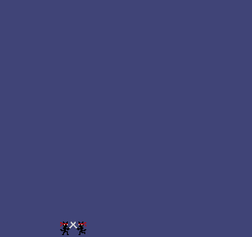

# CATANA

Author: Andrew Knowles

Design: This game is a beat-em-up style swordfighting game, where you play as a katana-wielding cat.

Screen Shot:

Asset Pipeline:

For my asset pipeline I used a GIMP plugin (included in assets/pipeline) to extract large groups of tiles at once from joined sprite images, and save the layouts in a struct SpriteSpec. This allows me to have game objects which cycle through specs as a whole rather than changing individual tiles for all animations.

The plugin itself can be run when placed in the GIMP plugins folder via File > ComputerGameProgramming > Export Atlas.

I didn't really get to finish the game itself because this process took a really long time.

How To Play:

Arrow keys to move, z to attack. You can also double jump.

You have 3 hit points and need to survive enemies that spawn offscreen every few seconds. 

NOTE: I spent almost all of my time working on asset pipelines so the actual assets themselves are a little incomplete, and there are bugs. If nothing spawns try relaunching, I'm not sure why behavior is so inconsistent (load order is probably a factor).

This game was built with [NEST](NEST.md).

